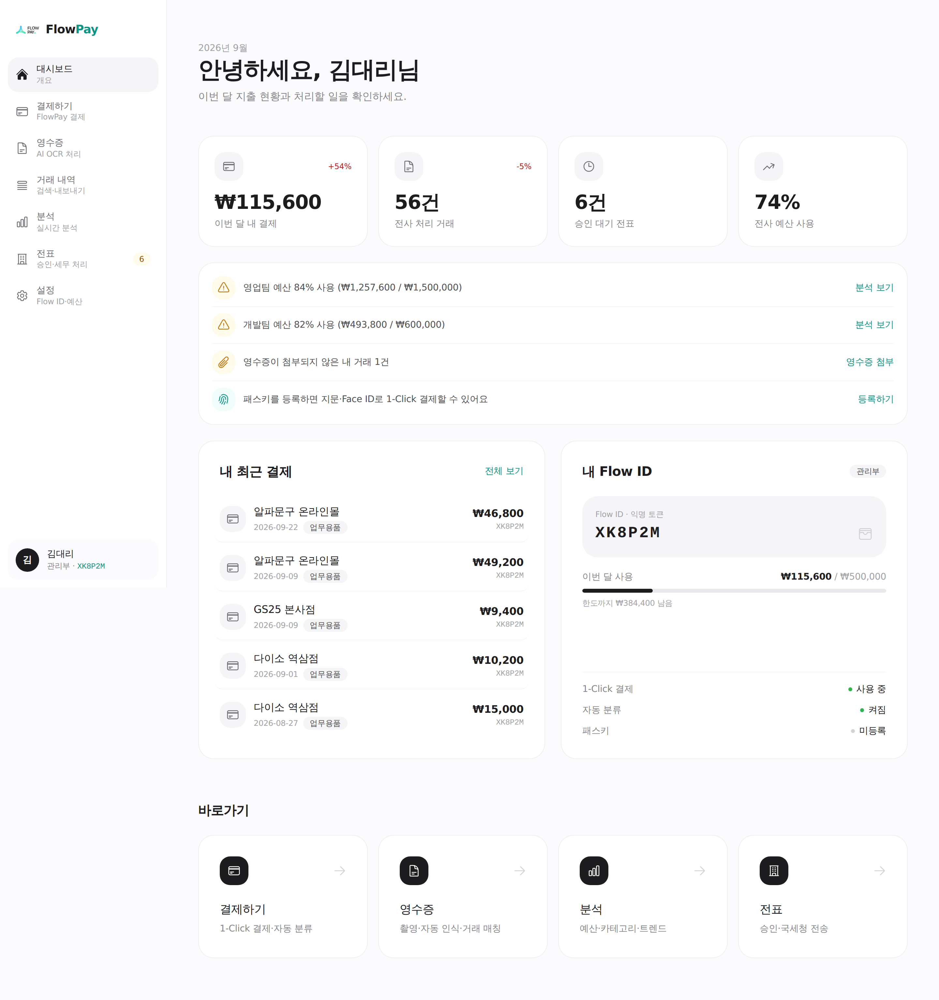
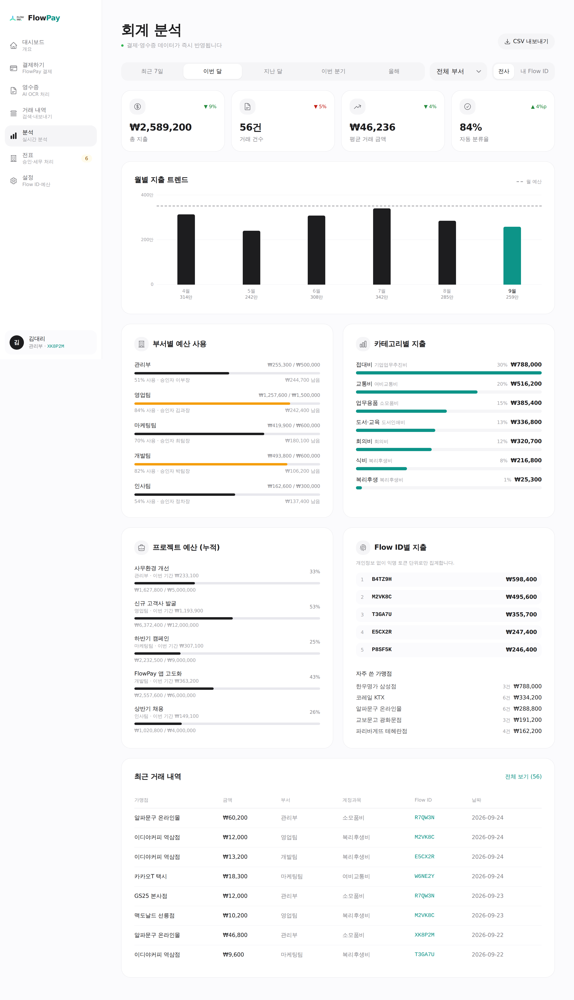
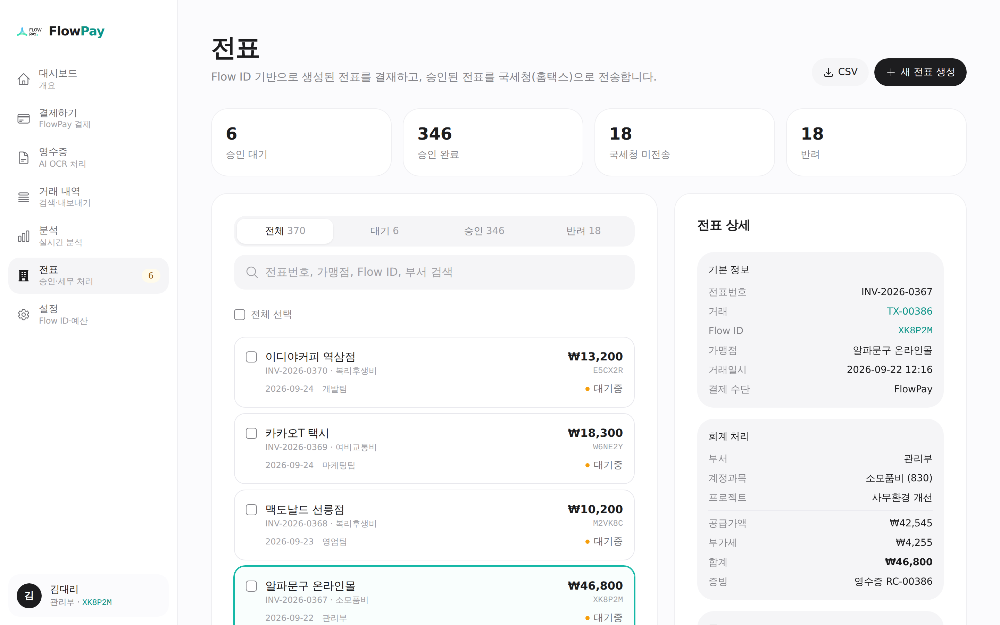
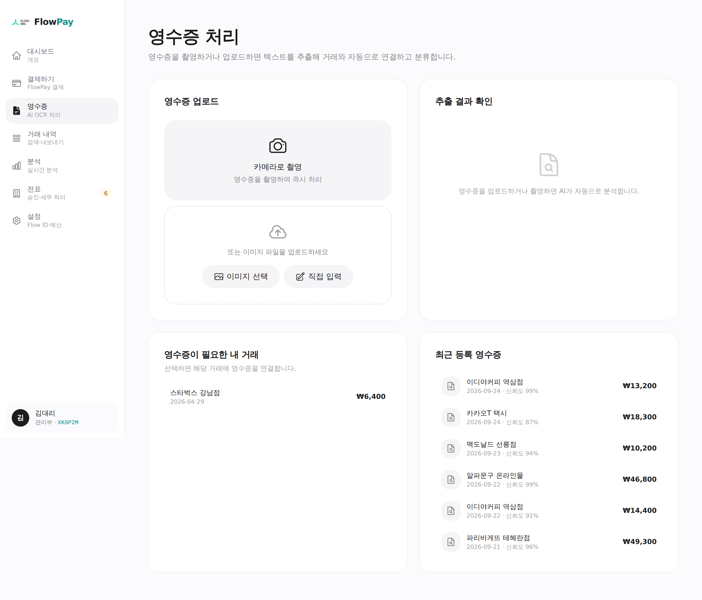
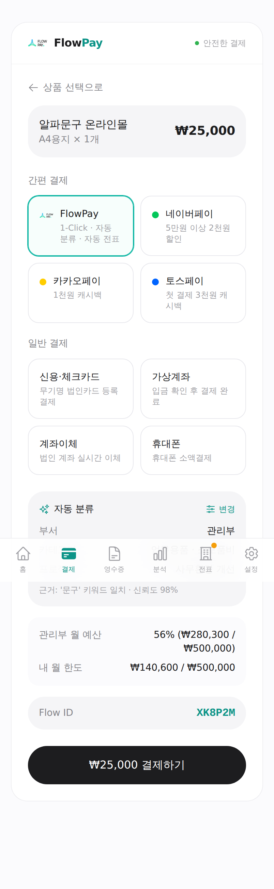

# FlowPay

무기명 법인카드의 익명성과 회계 자동화를 동시에 해결하는 결제·정산 관리 시스템입니다.
Flow ID 기반으로 결제 → 자동 분류 → 전표 생성 → 세무 처리까지 끊김 없이 이어집니다.

<p align="center">
  
</p>

<p align="center">
  <a href="https://flowpay.vercel.app">데모 바로가기</a>
</p>

---

## 개요

법인카드를 여럿이 함께 쓰는 무기명 방식은 편리하지만, 누가 무엇에 썼는지 추적하기 어렵고
회계 처리를 사람이 일일이 분류해야 하는 한계가 있습니다. FlowPay는 개인정보 대신 익명 토큰인
**Flow ID**로 사용자를 식별해 개인정보 부담 없이 지출을 추적하고, 결제 시점에 부서·카테고리를
자동 분류하여 전표와 세무 처리를 자동화합니다.

## 주요 기능

결제 → 분류 → 거래 기록 → 증빙 → 전표 → 결재 → 국세청 전송까지 하나의 데이터 흐름으로 연결됩니다.
모든 화면이 같은 저장소(`FlowPayContext`)를 공유하므로 결제하는 즉시 대시보드·분석·전표에 반영됩니다.

- **Flow ID** — 혼동 문자를 뺀 6자리 익명 토큰을 `crypto.getRandomValues`로 발급합니다. 재발급해도 이전 토큰의 거래는 '내 거래'로 함께 조회되며, 표시 이름은 기기에만 저장되고 거래·전표에는 Flow ID만 기록됩니다.
- **FIDO2 패스키 1-Click 결제** — WebAuthn으로 플랫폼 인증기(지문·Face ID)를 등록하고 결제 시 인증합니다. 지원하지 않는 환경에서는 데모 패스키로 흐름을 체험할 수 있습니다.
- **결제** — 제휴 가맹점 장바구니, FlowPay·간편결제·카드·가상계좌·계좌이체·휴대폰 결제. 결제 전 부서 월 예산과 Flow ID 월 한도를 검사해 초과 시 차단(또는 경고)합니다.
- **자동 분류** — 가맹점·품목·메모 키워드와 결제 시간대·금액으로 카테고리(계정과목)와 프로젝트를 추정하고, 부서는 Flow ID의 소속 부서를 사용합니다. 분류 근거와 신뢰도를 보여주며 언제든 수정할 수 있습니다.
- **영수증 OCR** — 카메라 촬영·파일 업로드·직접 입력. Tesseract.js(`kor+eng`, 필요할 때만 로드)의 실제 진행률과 신뢰도를 표시하고, 합계·날짜·사업자등록번호·품목을 추출합니다. 금액·날짜(±3일)가 맞는 영수증 미첨부 거래를 자동으로 찾아 연결하거나, 오프라인 카드 결제로 새 거래를 등록합니다.
- **거래 내역** — 가맹점·품목·Flow ID 검색, 기간·부서·카테고리·영수증 상태 필터, CSV 내보내기, 분류 수정, 결제 취소.
- **전표** — FlowPay 결제 시 자동 생성(또는 거래를 골라 일괄 생성). 공급가액/부가세 분리, 계정과목·코드, 부서별 승인자 자동 배정, 승인·반려(사유 필수)·일괄 승인, 국세청(홈택스) 전송 시뮬레이션, 인쇄용 지출결의서 미리보기, CSV·TXT 다운로드.
- **실시간 분석** — 기간(최근 7일~올해)·부서·범위(전사/내 Flow ID) 필터, 직전 동일 기간 대비 증감, 월별 지출 vs 예산 차트, 부서·카테고리·프로젝트 예산, Flow ID별 익명 집계, 자주 쓴 가맹점.
- **설정** — Flow ID 재발급, 패스키 등록/삭제, 1-Click·자동 분류·자동 전표·예산 초과 차단·경고 기준, 부서별 월 예산·승인자, JSON 백업, 데모 데이터 초기화.
- **PWA** — 홈 화면 설치, 오프라인 앱 셸(네트워크 우선 서비스 워커), 모바일 하단 탭 내비게이션.

> 백엔드가 없는 데모로, 데이터는 브라우저 `localStorage`에 저장되고 여러 탭 사이에 동기화됩니다.
> 처음 실행하면 최근 6개월치 데모 거래가 생성됩니다. 국세청 전송과 PG 승인은 시뮬레이션입니다.

## 화면

| 실시간 분석 | 전표 생성 |
| :---: | :---: |
|  |  |

| 영수증 OCR | 결제 (모바일) |
| :---: | :---: |
|  |  |

## 기술 스택

- **프레임워크** — React 19, TypeScript
- **스타일** — Tailwind CSS 3, Framer Motion
- **라우팅** — React Router 7
- **OCR** — Tesseract.js (`kor+eng`)
- **아이콘** — Heroicons
- **배포** — Vercel (PWA)

## 디자인

Apple 스타일 가이드를 참고해 **무채색 기반 + teal 소량 강조**로 구성했습니다.

- SF Pro 시스템 폰트 스택과 타이트한 자간
- 넉넉한 여백, 얇은 보더와 은은한 그림자 (그라디언트·과한 그림자 배제)
- 브랜드 컬러(teal)는 링크·활성 상태·강조에만 절제하여 사용
- 라이트/데스크톱·모바일 반응형 (모바일 하단 탭 내비게이션)

## 실행 방법

```bash
# 의존성 설치
npm install

# 개발 서버 (http://localhost:3000)
npm start

# 테스트 (영수증 파서·자동 분류·상태 전이·렌더링)
npm test

# 프로덕션 빌드
npm run build
```

## 프로젝트 구조

```
FlowPay/
├── public/                  # 정적 파일, PWA 매니페스트, 서비스 워커
├── docs/screenshots/        # README용 화면 캡처
├── src/
│   ├── components/
│   │   ├── Dashboard.tsx        # 대시보드 (지출 현황·처리할 일·내 Flow ID)
│   │   ├── PGPayment.tsx        # 결제 (장바구니·자동 분류·예산 검사·패스키 인증)
│   │   ├── ReceiptUpload.tsx    # 영수증 OCR·거래 매칭
│   │   ├── Transactions.tsx     # 거래 내역·상세
│   │   ├── Analytics.tsx        # 회계 분석·월별 트렌드 차트
│   │   ├── InvoiceGenerator.tsx # 전표 결재·국세청 전송·지출결의서
│   │   ├── Settings.tsx         # Flow ID·패스키·정책·예산
│   │   ├── Sidebar.tsx          # 데스크톱 사이드바 + 모바일 탭바
│   │   ├── ui.tsx               # 공통 UI (모달·토스트·토글 등)
│   │   ├── Logo.tsx
│   │   └── PWAInstallPrompt.tsx
│   ├── store/
│   │   ├── FlowPayContext.tsx   # 전역 상태·액션·영속화
│   │   ├── reducer.ts           # 순수 상태 전이
│   │   └── selectors.ts         # 예산 검사·집계·영수증 매칭
│   ├── data/
│   │   ├── constants.ts         # 부서·프로젝트·카테고리(계정과목)·가맹점
│   │   └── seed.ts              # 데모 데이터 생성
│   ├── utils/                   # 분류기·영수증 파서·패스키·Flow ID·CSV·날짜
│   ├── __tests__/
│   ├── App.tsx
│   └── types/index.ts
├── tailwind.config.js
└── vercel.json
```

## 배포

- 저장소: <https://github.com/tlstkdgus/FlowPay>
- 프로덕션: <https://flowpay.vercel.app>
